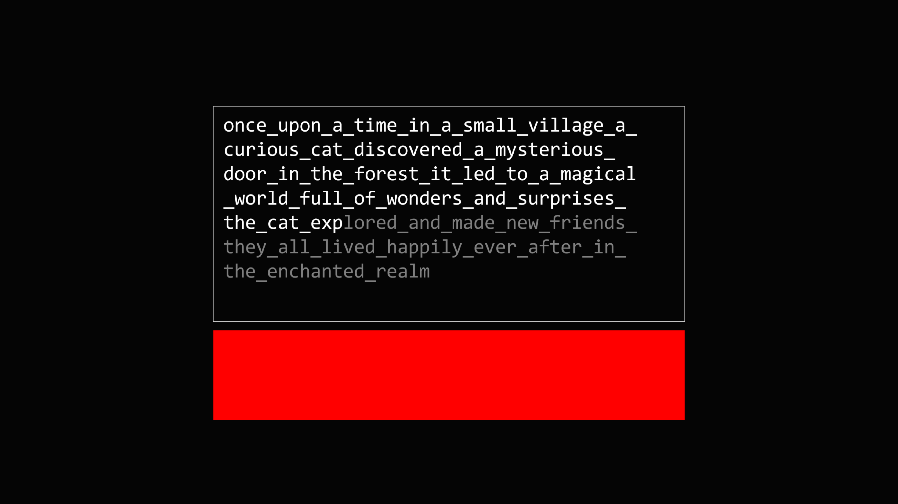
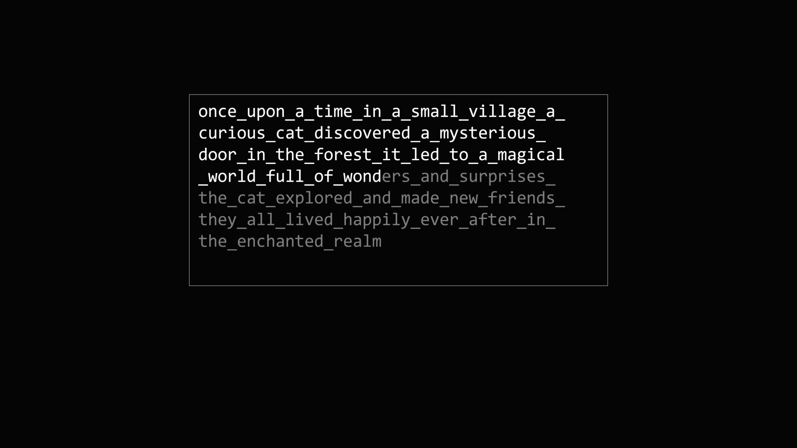
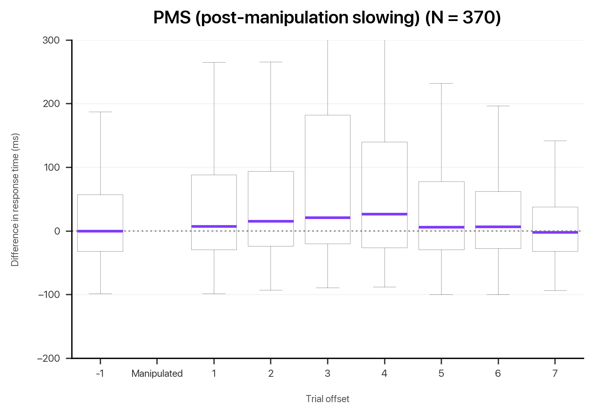

# Cognitive Authorship Illusions w/ EEG

Adaptation of Logan & Crump (2010)[^1], adding EEG-recording to the experimental setup with the aim of shedding further light on dissociation of two distinct monitoring systems in a typing task.

## Quickstart
1. Download/clone the repository locally
2. Run the directory as a module (`python cognitive-authorship-illusions`) to launch the experiment

## Showcase
 Negative Feedback  |  Positive Feedback  |
:---------------------------------------:|:----------------------------------------:|

## Analysis
>
>Following a manipulation, slowing effects creep in gradually, peaking at a delay of three or four trials since the manipulation before tapering off.

[^1]: Logan, G. D., Crump, M. J. C., 2010. Cognitive Illusions of Authorship Reveal Hierarchical Error Detection in Skilled Typists. Science 330, 683–686. https://doi.org/10.1126/science.1190483